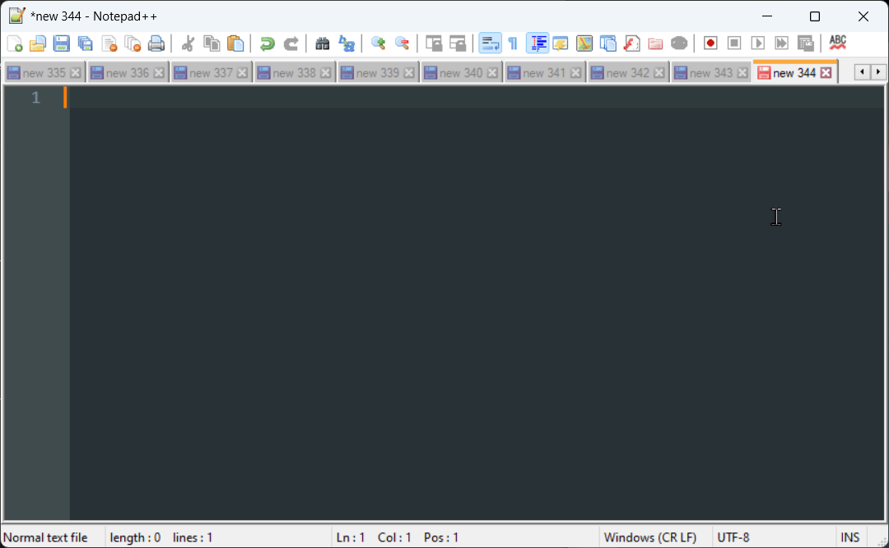

# Voice Typing Assistant

A lightweight Python desktop app for Windows that improves upon Windows Voice Typing (Win+H) by offering superior transcription accuracy while maintaining a simple, intuitive interface.



## Overview

The app works as follows:
- Press Caps Lock to begin recording your voice (without activating Caps Lock)
- A small red indicator appears in the top-right corner showing "🎤 Recording"
- Audio level visualization shows your current input volume
- Press Caps Lock again to stop recording and process the audio
- The audio is sent to OpenAI Whisper for transcription
- (beta, optional) The transcribed text is cleaned and inserted at the cursor location
- The transcribed text is automatically inserted at your current cursor position in any text field or editor
- Settings and recent transcriptions can be accessed via the system tray icon

## Features

### Controls
- **Toggle Recording**: Caps Lock (normal Caps Lock functionality still available with Ctrl+Caps Lock)
- **Cancel Recording**: Click the recording indicator

### Tray Options/Settings
- Recent Transcriptions: Access previous transcriptions, copy to clipboard
- Continuous Capture: Default recording mode. Record audio until the user stops it, send it all at once to OpenAI Whisper
- (beta) Clean Transcription: Enable/disable text cleaning using Anthropic Claude Haiku


### Tray History
- Keeps track of recent transcriptions
- Useful if your cursor was in the wrong place at the time of insertion
- Quick access to copy previous transcriptions from system tray

## Technical Details
- Built with Python using tkinter for UI
- OpenAI Whisper API for transcription
- Only tested on Windows OS and >Python 3.8

## Current Limitations
- Maximum recording duration of ~10 minutes per transcription due to OpenAI Whisper API's 25MB file size limit
- Currently uses system default microphone with no in-app selection option

## Setup/Installation

1. Clone the repository:
   ```bash
   git clone https://github.com/Elevate-Code/better-voice-typing
   cd better-voice-typing
   ```
2. Create a virtual environment using `python -m venv venv`
3. Run `venv\Scripts\activate` to activate the virtual environment
4. Run `pip install -r requirements.txt` to install all dependencies
5. Create a `.env` file based on `.env.example` by running `cp .env.example .env`
6. Set up your API keys:
   - Get an OpenAI API key from [OpenAI's API Keys page](https://platform.openai.com/api-keys)
   - (Optional) Get an Anthropic API key if you want to use the text cleaning feature
   - Add these keys to your `.env` file
7. Run the app by double-clicking `voice_typing.pyw`, and add a shortcut to your startup folder to launch automatically on system boot

## TODO
- [ ] Customizable activation shortcuts for recording control
- [ ] Improved transcription accuracy for code variables, proper nouns and abbreviations using screenshot context and cursor position via VLM
- [ ] Manual retry option for failed transcriptions via tray menu (especially important for longer recordings)
- [ ] Smart Capture: Record audio in 1-2 minute chunks with silence detection, process chunks with Whisper in background, then combine and clean results with an LLM
- [ ] Add microphone selection via system tray menu (currently locked to system default)

## Contributing

TBD, for now, just create a pull request and start a conversation.

## License

This project is licensed under the MIT License - see the [LICENSE](LICENSE) file for details.